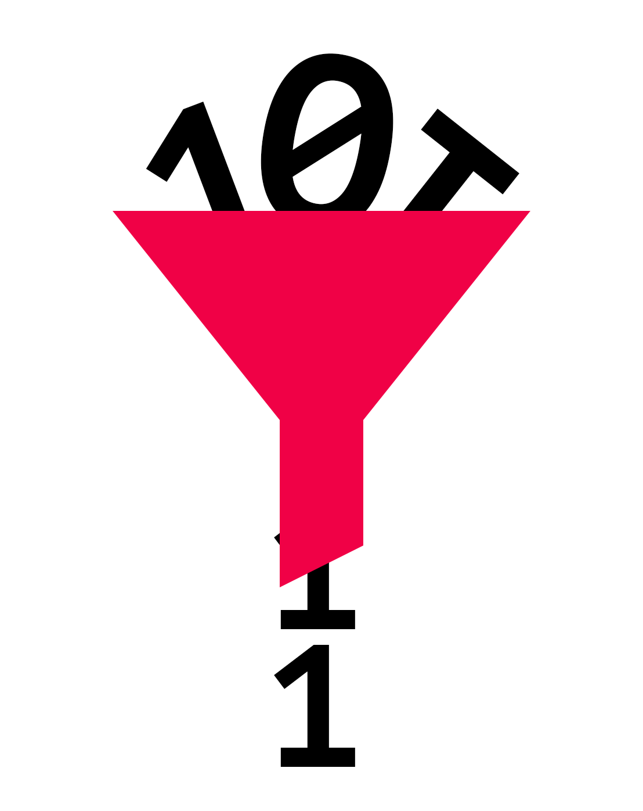

<p></p>
<p></p>

https://github.com/Oaxoa/fp-filters

# fp-filters

A collection of common filter functions that are written (and can be used) in a functional programming style.

fp-filters functions are:

1. pure
2. tiny
2. composable
3. zero-dependencies
4. grouped by semantics
5. tree-shakeable
6. 100% tested by design

### Why

See how _fp-filters_ allows you to stop rewriting the same code over and over again and greatly improves readability:

## Examples

#### values and numbers examples:

```js
// JS
ids.filter((id) => id === currentUserId);
// fp-filters
ids.filter(is(currentUserId));
```

```js
// JS
scores.filter((element) => element !== 0);
// fp-filters
scores.filter(isNotZero);
```

```js
// JS
array.filter((arg) => arg % 2 === 0);
// fp-filters
array.filter(isEven);
```

```js
// JS
array.filter((arg) => arg >= 10 && arg <= 50);
// fp-filters
array.filter(isBetween(10, 50));
```

#### collections examples:

```js
const allergens = ['crustaceans', 'gluten', 'mushrooms', 'peanuts',];
// JS
const allergenIngredients = ingredients.filter((arg) => allergens.includes(arg));
// fp-filters
const allergenIngredients = ingredients.filter(isIncludedIn(allergens));
```

```js
// JS
products.filter((obj) => obj.id !== undefined && obj.plu !== undefined);
// fp-filters
products.filter(hasProps(['id', 'plu']));
```

```js
// JS
products.find((obj) => obj.country === countryId && obj.plu === plu);
// fp-filters
products.find(hasProps(['country', 'plu'], [countryId, plu]));
```

```js
// JS
array.filter((obj) => obj.id === someOtherObj.id && obj.brand === someOtherObj.brand);
// fp-filters
array.filter(hasSameProps(someOtherObj, ['id', 'brand']));
```

```js
// JS
array.filter((arg) => arg.length > 0);
// fp-filters
array.filter(isNotEmpty);
```

#### types examples:

```js
// JS
array.filter((arg) => arg !== null && arg !== undefined);
// fp-filters
array.filter(isNotNil);
```

```js
// JS
array.filter((arg) => typeof arg === 'boolean');
// fp-filters
array.filter(isBoolean);
// do not be tricked by `array.filter(Boolean);`. It is different as 
// it casts the content and then evaluate its truthyness
```

#### position examples:

```js
// JS
array.filter((arg, index) => index % 3 === 0 || index % 2 === 2);
// fp-filters
array.filter(pattern(false, true, true));
```

```js
// JS
array.filter((arg, index) => index % 3 === 1);
// fp-filters
array.filter(isNthIndex(3, 1));
```

## Negate or combine filters

All the functions include aliases for their negated versions:

```js
// E.g.: 
array.filter(is(5))
array.filter(isNot(5))

array.filter(isBetween(5, 10))
array.filter(isNotBetween(5, 10))

array.filter(isNil)
array.filter(isNotNil)

array.filter(isEmpty)
array.filter(isNotEmpty)

array.filter(isInstanceOf(SomeClass));
array.filter(isNotInstanceOf(SomeClass));
```

but **you can make your own**.

> _fp-filters_ leaverages _fp-booleans_ 's very powerful functions to combine or negate functions

#### Some examples:

```js
array.filter(not(is(5)));
array.filter(and(isGreaterOrEqualTo(MIN_PRICE), not(isRound)));
array.filter(or(is('admin'), and(startsWith('user_'), isLowerCase)));
```

### Getting started

#### Installation

fp-filters runs on Node.js and is available as a NPM package.

```bash
npm install --save fp-filters
```

or

```bash
yarn add fp-filters
```

## Contributions

[MIT](https://opensource.org/licenses/MIT)

Copyright (c) 2023-present, Pierluigi Pesenti (Oaxoa)